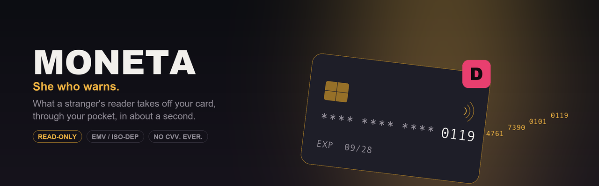
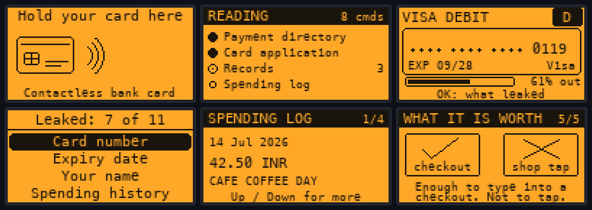

<div align="center">



# Moneta

**She who warns.**

Hold your own bank card against a Flipper Zero. Moneta has the same conversation with it that a shop terminal does — and then shows you everything the card handed over on the way.

[](https://github.com/at0m-b0mb/Moneta-FlipperZero/actions/workflows/build.yml)


-8a2be2)


</div>

---

## The thing nobody tells you when they send you the card

Your contactless bank card has no off switch, no battery, and no way of knowing who is asking.

It does not know whether the reader in front of it belongs to a supermarket, a bus, or a stranger standing behind you on a train. It cannot tell the difference, it is not designed to, and it answers all of them the same way: instantly, silently, and without needing your PIN, your permission, or your attention.

Most of what it answers with is dull. Two fields are not.

**Moneta is the tool that shows you those two fields, on your own card, in about a second.**

<div align="center">



*Waiting · reading · what it took · the breakdown · your spending log · what it is actually worth*

</div>

---

## What it actually does

- **Talks to the card** exactly the way a payment terminal does — SELECT the payment directory, SELECT an application, ask for its processing options, read the records it points at — and **stops** at the moment a terminal would ask for a cryptogram and take your money.
- **Shows you the card back**, on screen: the same rectangle, the same chip, the same number, masked until you deliberately hold OK.
- **Grades the exposure** from A+ to F, and explains every single field: what it is, what it enables, and what actually stops it.
- **Reads the spending log**, if your card keeps one. Some do. Date, amount, currency, and the merchant's name.
- **Names what it cannot get**, which is just as important as what it can.

It never writes to the card. It never emulates one. It never authorises anything. Nothing it reads is written to the SD card, and nothing survives closing the app.

---

## The exposure model

This is the part that turns a hex dump into a point.

| Field | Points | Why that many |
|---|---:|---|
| **Card number** | 35 | It is the account. A PAN that fails its own check digit scores nothing — that is a mask, not a number. |
| **Expiry date** | 20 | The second field an online checkout asks for. Travels inside the same tag as the number. |
| **Your name** | 20 | Turns a stolen number into a convincing phone call. Many issuers now send `UNKNOWN`. Some do not. |
| **Spending history** | 10 | Where you have been, readable in a second, without your bank. |
| **Merchant names** | 8 | Turns a list of amounts into a map of your week. |
| **Service code** | 2 | Historically copied onto forged magnetic stripes. |
| Tap counter, PIN tries, country, currency, product | 1 each | Fingerprinting. Real, but not monetisable. |

| Score | Grade | What it means |
|---:|:---:|---|
| 0 | **A+** | Nothing readable. Your card refused every question. |
| 1–15 | **A** | Only fingerprint data. The account number stayed private. |
| 16–35 | **B** | Some detail leaked, but not the account number. |
| 36–55 | **C** | Real data left your card without your consent. |
| 56–75 | **D** | Number and expiry, in the clear. |
| 76–100 | **F** | Number, expiry and more. A stranger now knows who you are. |

**One rule overrides the bands.** Once the card number and the expiry date are *both* readable, the grade can never be better than a **D**, no matter how restrained the card is about everything else — because at that point a stranger can walk away and try to spend it. The weights already land there; the floor makes it a promise rather than a coincidence, and [the tests](test/host_emv_test.c) hold it to that.

Most ordinary high-street cards score a **D**. That is not a bug in the scoring. That is the finding.

---

## What no reader can take — including this one

An app that only listed the bad news would be a scare, not an education. So Moneta ships the other half, reachable from the main menu without reading anything:

| | |
|---|---|
| **The three digits (CVV)** | Not stored on the chip and not transmitted. It is printed on the card and nowhere else, which is precisely why checkouts ask for it. |
| **Your PIN** | Never leaves the chip. The card verifies it internally and answers only yes or no. There is no command that reads it out. |
| **A reusable payment** | Every tap is signed with a one-time cryptogram over a counter and a number the terminal picks. Recording a tap and replaying it later fails. |
| **Your balance** | Not on the chip. The card carries an account number, not an account. |

So: **this leak does not let anyone tap your card in a shop.** It lets them type your number into a website. Getting that distinction right is the difference between teaching someone and frightening them, and the final panel of the built-in walkthrough says exactly that.

---

## How the read works

```
SELECT 2PAY.SYS.DDF01      →  the payment directory: which applications this card has
SELECT <AID>               →  open one: label, product name, the terminal data it wants
GET PROCESSING OPTIONS     →  the Application File Locator: where the data lives
READ RECORD × n            →  the records themselves — this is the step that returns the PAN
GET DATA 9F36 / 9F17       →  tap counter, PIN tries remaining
READ RECORD (log SFI)      →  the transaction log, if tags 9F4D and 9F4F admit to one
```

Eight commands. About a second. No PIN, no confirmation, no trace on the card that it happened. The reading screen counts them as they go, because the number is part of the argument.

Everything runs over the firmware's ISO-DEP layer (`iso14443_4a_poller_send_block`), on a worker thread, on the internal NFC hardware. **No add-on board of any kind is required.**

---

## Demo mode

Three saved cards, for a talk, a classroom, or a screenshot with no wallet involved:

- **High-street debit** — full number, full expiry, no name. What most wallets do. Grades **D**.
- **Talkative credit** — a real cardholder name and four logged purchases with merchant names. Grades **F**.
- **Well-behaved card** — an issuer that keeps the number off the readable records entirely. Passes.

These are not mock-ups of results. They are byte-for-byte EMV responses ([`tools_gen_demo.py`](tools_gen_demo.py)) replayed through the same parser the radio path uses, so a demo screenshot is a genuine parse. If the parser regresses, the demo regresses with it.

---

## Install

Grab `moneta.fap` from the [latest release](https://github.com/at0m-b0mb/Moneta-FlipperZero/releases/latest) and drop it in `SD Card/apps/NFC/` on your Flipper. It appears under **Apps → NFC → Moneta**.

Built against the official firmware, Target 7 / API 87.1. CI also builds it against the dev channel on every push.

## Build from source

```bash
python3 -m pip install --upgrade ufbt
git clone https://github.com/at0m-b0mb/Moneta-FlipperZero.git
cd Moneta-FlipperZero
ufbt
```

The `.fap` lands in `dist/`. `ufbt launch` builds and installs it to a connected Flipper in one step.

## Tests

The BER-TLV parser eats attacker-controlled bytes off a radio, and the grade is the only part of this app anyone actually acts on. Neither is something to verify by looking at a screenshot, so both are plain C with no Flipper headers — precisely so this can exist:

```bash
make -C test
```

335 checks over the TLV reader (including truncated, runaway and over-nested input), Luhn, Track 2, every scheme prefix, the log parser, and every grade boundary and floor rule — compiled with `-Werror` and the address and undefined-behaviour sanitisers, and run on every push.

The screen mock-ups in `images/` are generated from the same layout constants the views use ([`tools_gen_mockups.py`](tools_gen_mockups.py)), which is how three text-overflow bugs got caught before this shipped.

---

## Please read this part

**Use it on your own card.**

Reading a payment card belonging to someone who has not asked you to is wrong, and in most jurisdictions it is a criminal offence. Moneta exists so you can find out what your own wallet gives away, and so you can show someone else what theirs does — with their card, in their hand, at their invitation.

The application has no transmit path for a transaction, no emulation, no write commands, and no way to save a card number anywhere. That is deliberate, and it is not the sort of thing that should be quietly changed by a pull request.

If your card grades badly, the useful move is not panic. It is:

- Ask your issuer why your card still sends your **name**, and whether it keeps a readable **transaction log**. Both are their choice, and some banks have already stopped.
- Use a phone or watch wallet where you can. Those send a device number, not your real one.
- A shielded wallet or sleeve genuinely works, because range is the whole defence.

---

<div align="center">

Built by [at0m-b0mb](https://github.com/at0m-b0mb) · MIT licensed

*Moneta was the epithet of Juno whose temple minted Rome's coins.<br>It means "she who warns", and it is where the word money comes from.*

</div>
